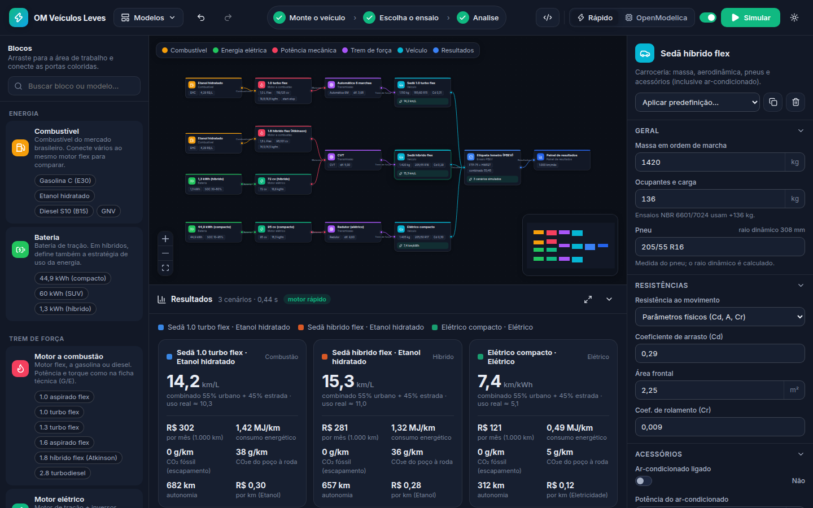
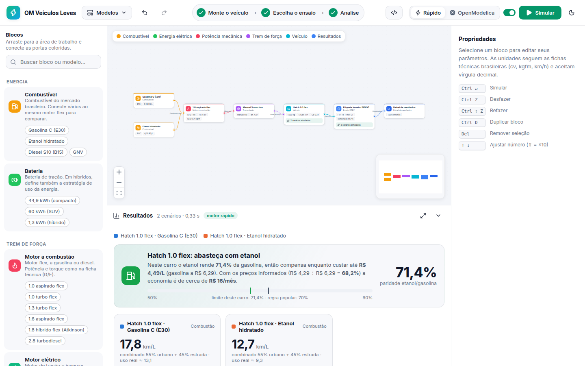

# OM Veículos Leves

Ambiente visual, baseado em **workflows arrastáveis**, para analisar **consumo, custo, emissões e
desempenho de veículos leves no contexto brasileiro**, usando o **OpenModelica** como motor de
simulação.



Você monta o fluxo da esquerda para a direita, arrastando blocos e ligando portas coloridas:

```
Combustível ─▶ Motor a combustão ─┐
                                   ├─▶ Transmissão ─▶ Veículo ─▶ Ensaio ─▶ Painel de resultados
Bateria ─────▶ Motor elétrico ────┘
```

- **Um motor flex ligado a gasolina e etanol** gera os dois cenários e calcula a **paridade de preço**
  (até quanto o etanol compensa *naquele carro*, em vez da "regra dos 70%").
- **Motor a combustão + motor elétrico na mesma transmissão** forma um **híbrido**; só o elétrico,
  um **BEV**.
- **Um veículo ligado a vários ensaios** é simulado em todos; vários veículos no mesmo ensaio são comparados.



## O que já vem pronto

| Bloco | O que representa |
|---|---|
| Combustível | Gasolina C (teor de etanol editável, E30 por padrão), etanol hidratado (EHC), diesel S10 (B15), GNV; preço na bomba |
| Bateria | Capacidade, faixa de SOC, eficiências, tarifa e fator de emissão da rede; estratégia do híbrido |
| Motor a combustão | Flex / gasolina / diesel com potência e torque **G/E em cv e kgfm**, como na ficha técnica; start-stop, corte de injeção |
| Motor elétrico | Potência/torque de pico, eficiência, frenagem regenerativa |
| Transmissão | Manual, automática, CVT ou redutor fixo; estratégia de troca de marchas |
| Veículo | Massa, carga, pneu (ex.: `185/65 R15` → raio calculado), Cd·A·Cr ou coast-down F0/F1/F2, **ar-condicionado**, tanque |
| Ensaio PBEV | Urbano **FTP-75 (ABNT NBR 6601)** ponderado por fases + estrada **HWFET (ABNT NBR 7024)** + combinado **55/45** |
| Ciclo de condução | FTP-75, HWFET, US06, velocidade constante ou **perfil próprio (CSV)**; temperatura, altitude, rampa |
| Desempenho | 0–100 km/h, retomada 80–120 km/h, velocidade máxima, peso/potência |
| Painel de resultados | km/L (ou km/kWh), custo por km e **por mês**, MJ/km, **CO₂ fóssil** (etanol e biodiesel são biogênicos, como no PBEV), **CO₂e do poço à roda**, autonomia, paridade etanol × gasolina, gráficos no tempo e balanço de energia |

Modelos prontos no menu **Modelos**: *Etanol ou gasolina?*, *Flex × híbrido × elétrico*,
*Desempenho 0-100*, *Calor e ar-condicionado* e *Em branco*.

A interface tem desfazer/refazer, salvamento automático no navegador, importação/exportação do
workflow em JSON, tema claro/escuro, modo **ao vivo** (recalcula a cada alteração) e exportação dos
resultados em CSV (separador `;` e vírgula decimal, prontos para o Excel em português).

## Dois motores de cálculo, mesmas equações

| Motor | Uso | Tempo típico |
|---|---|---|
| **Rápido** (Python) | Exploração interativa, modo ao vivo | ~0,1 s por ciclo |
| **OpenModelica** | Simulação oficial: gera um modelo Modelica por cenário, compila e simula com o `omc` | ~1 s por ciclo |

Os dois implementam o mesmo modelo e são comparados nos testes automatizados
(`backend/tests/test_modelica.py`). Com o OpenModelica 1.26 a diferença no consumo é menor que
0,01 % nos veículos a combustão e elétricos e ~0,1 % no híbrido; os tempos de 0–100 km/h coincidem.

O botão **Modelica** mostra (e permite baixar) o código gerado para os cenários do workflow. Ele
estende os experimentos da biblioteca [`modelica/VeiculosLevesBR`](modelica/VeiculosLevesBR), que
não depende da Modelica Standard Library e pode ser aberta em qualquer ferramenta Modelica.

## Como executar

Requisitos: Python ≥ 3.10 e Node.js ≥ 20.19. O OpenModelica é opcional (sem ele, só o motor rápido
fica disponível).

```bash
cd OMVeiculos
./iniciar.sh            # cria .venv, compila a interface e abre http://127.0.0.1:8000
```

Ou, passo a passo (também no Windows):

```bash
pip install -e "OMVeiculos/backend[dev]"
cd OMVeiculos/frontend && npm ci && npm run build && cd ..
cd backend && python -m omveiculos --abrir
```

### OpenModelica

O servidor procura o `omc` em `OMVEICULOS_OMC`, em `$OPENMODELICAHOME/bin/omc` ou no `PATH`
(`python -m omveiculos --omc /caminho/do/omc` também funciona). Opções de instalação:

- instalador oficial em <https://openmodelica.org/download/>;
- conda-forge, que traz o compilador C necessário:

  ```bash
  micromamba create -p ./omenv -c conda-forge omcompiler
  ./iniciar.sh --omc ./omenv/bin/omc
  ```

Se o compilador C usado pelo `omc` não estiver no `PATH`, defina `OMVEICULOS_CC` (instalações do
conda-forge são detectadas automaticamente).

### Desenvolvimento

```bash
cd OMVeiculos/backend && python -m omveiculos          # API em :8000
cd OMVeiculos/frontend && npm run dev                   # interface em :5173 (proxy para /api)
cd OMVeiculos/backend && pytest                         # testes (os de OpenModelica rodam se houver omc)
python OMVeiculos/scripts/gerar_ciclos_modelica.py      # regenera Ciclos.mo a partir dos CSVs
```

## Modelo físico

Abordagem quasi-estática "para trás": o veículo segue exatamente o perfil do ciclo.

- **Carroceria**: `F = m_eq·a + Cr·m·g·cosθ + ½·ρ·Cd·A·v² + m·g·sinθ` (ou `F0 + F1·v + F2·v²`), com ρ
  calculada pela temperatura e altitude do ensaio.
- **Decisões a cada 1 s** (marcha, relação do CVT, motor a combustão ligado/desligado no híbrido),
  com base na velocidade e potência médias do intervalo; grandezas contínuas integradas dentro do
  intervalo (`when sample(0, 1)` no Modelica).
- **Motor a combustão**: linha de Willans com atrito (FMEP em função da rotação) e bombeamento que cai
  com a carga; eficiência indicada aumenta com o teor de etanol; corte de injeção, marcha lenta e
  start-stop; curva de torque a plena carga a partir da ficha técnica.
- **Elétrico**: eficiência média do conjunto motor+inversor, regeneração limitada por potência,
  torque e SOC; bateria com eficiência de carga/descarga e do carregador.
- **Híbrido paralelo (P2)**: modo elétrico em baixa velocidade/potência; com o motor a combustão
  ligado, recarga proporcional ao déficit de SOC e assistência elétrica; consumo corrigido pelo
  balanço líquido da bateria.
- **Desempenho**: aceleração plena com a melhor marcha a cada instante, inércia do motor refletida na
  roda, limite de aderência no eixo motriz.

### Dados de referência (todos editáveis)

- Gasolina C E30 (Lei 14.993/2024), etanol hidratado 93,5 % m/m (faixa ANP), diesel B15.
- Intensidade de carbono poço-roda: gasolina A 87,4 e diesel A 86,5 gCO₂e/MJ (referências fósseis do
  RenovaBio); etanol de cana 27 e biodiesel 30 gCO₂e/MJ (valores típicos; variam por usina).
- Eletricidade: 40 gCO₂/kWh (ordem de grandeza do fator médio do SIN/MCTI) e R$ 0,89/kWh.
- Preços de combustível são apenas referência — atualize nos blocos.
- Os veículos e motores predefinidos são **arquétipos genéricos** de categorias do mercado, não
  reproduções de modelos comerciais.

### Limitações conhecidas

- Os valores principais são de **laboratório** (como no ensaio NBR 7024). A coluna "uso real" aplica
  as fórmulas de ajuste da EPA em base energética, apenas como indicação — não são os fatores do PBEV.
- Não há modelo de partida a frio nem de poluentes regulados (CO, NMOG+NOx, material particulado do
  PROCONVE); o CO₂ é calculado pelo balanço de carbono do combustível.
- A classificação A–E da etiqueta e as metas do programa Mover dependem de tabelas por categoria
  publicadas pelo Inmetro/MDIC e não estão incluídas; o MJ/km calculado é a grandeza usada por elas.
- A estratégia do híbrido é simplificada (paralelo P2) e não reproduz híbridos de divisão de
  potência (e-CVT).

## Estrutura

```
OMVeiculos/
├── backend/            API FastAPI + motor rápido + integração com o omc
│   ├── omveiculos/     combustiveis, ciclos, componentes, simulador, analise, workflow, modelica, api
│   └── tests/
├── frontend/           interface React + React Flow (TypeScript, Vite)
├── modelica/
│   └── VeiculosLevesBR/   biblioteca Modelica (Dados, Ciclos, Funcoes, Experimentos, Exemplos)
├── scripts/            utilitários (geração de Ciclos.mo)
├── docs/               capturas de tela
└── iniciar.sh
```

Os perfis de velocidade FTP-75/UDDS, HWFET e US06 são os *Dynamometer Driver's Aid* da EPA
(domínio público), obtidos dos recursos do NREL FASTSim.
